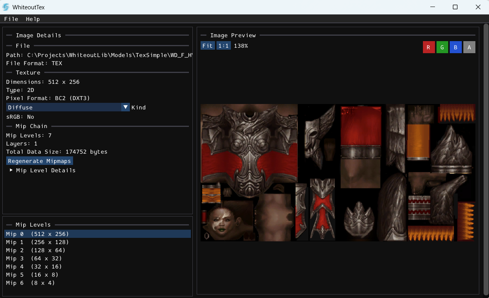
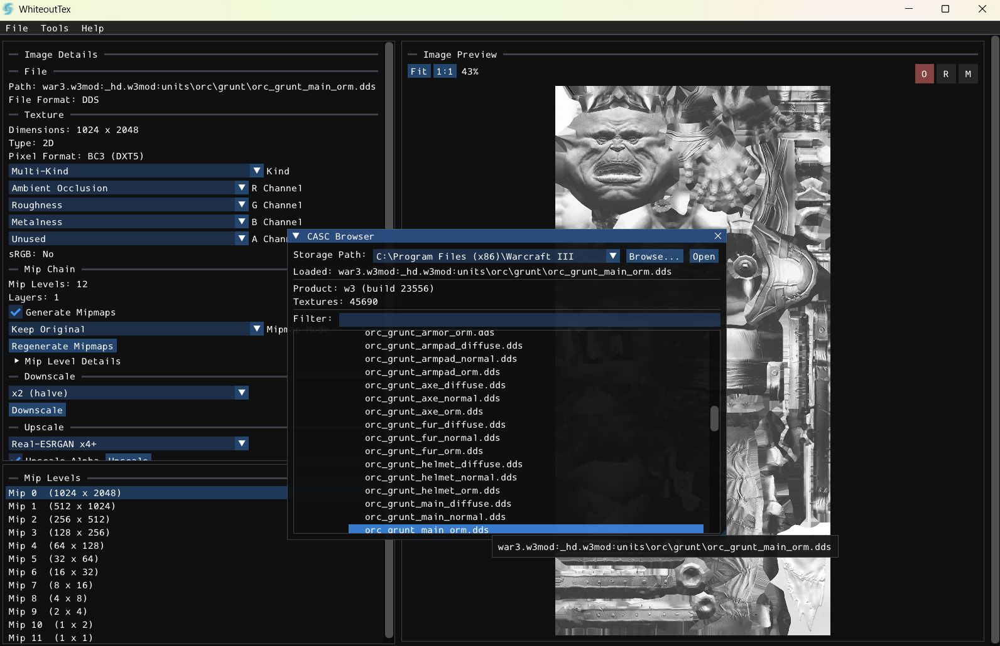
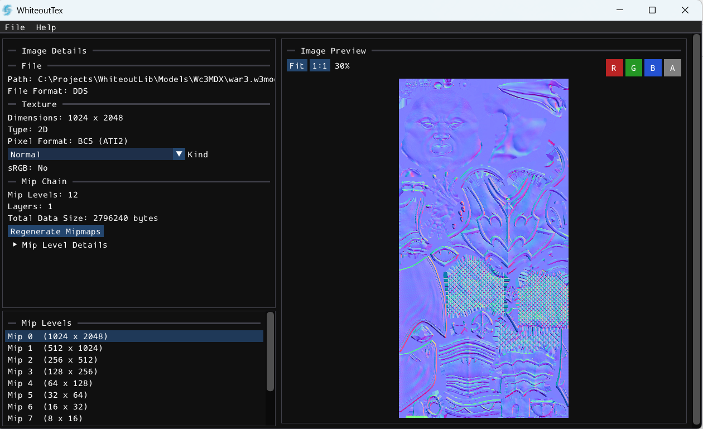
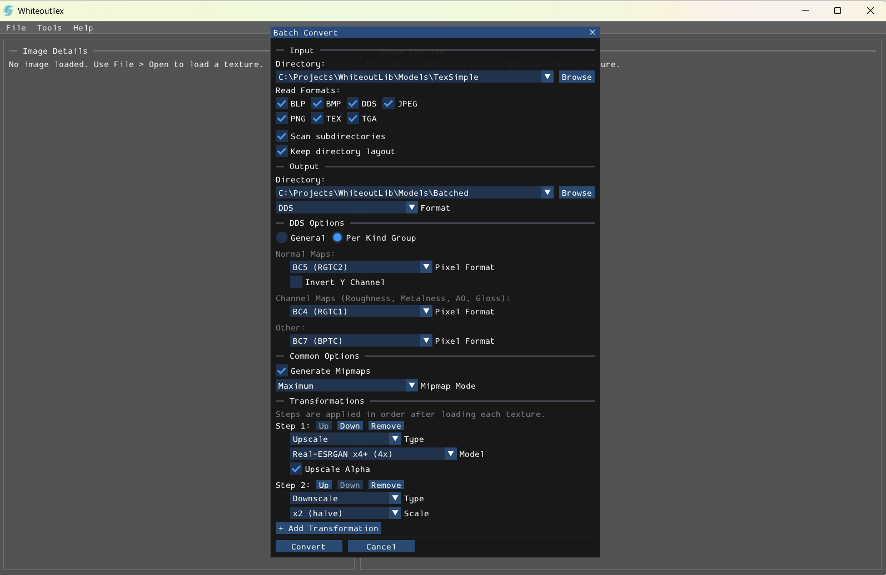
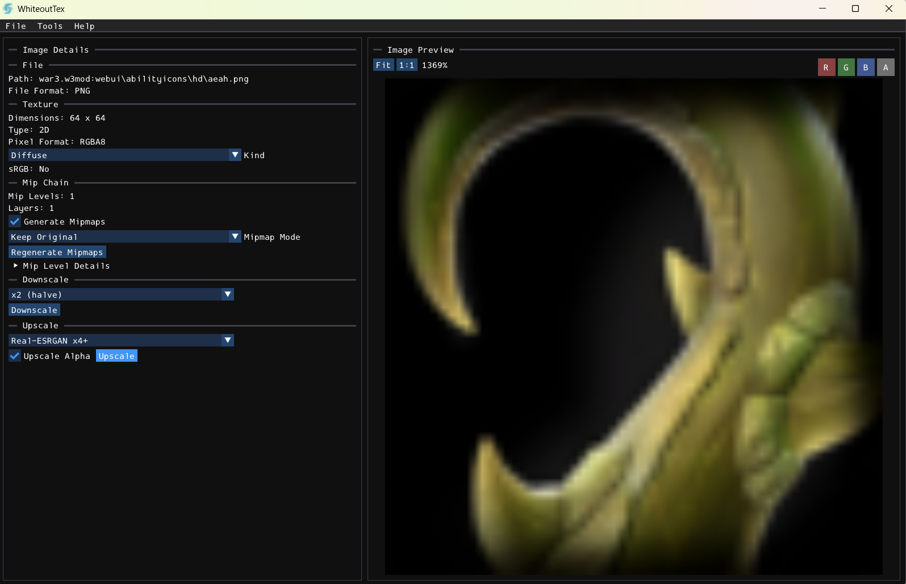
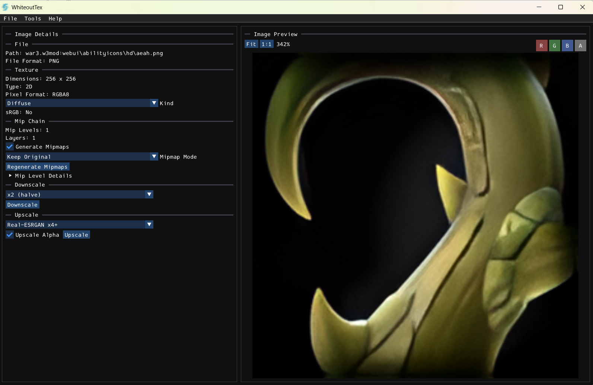
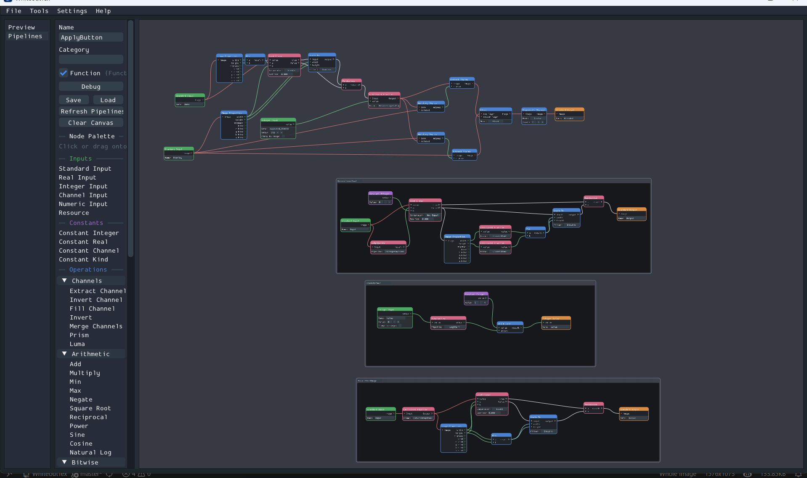
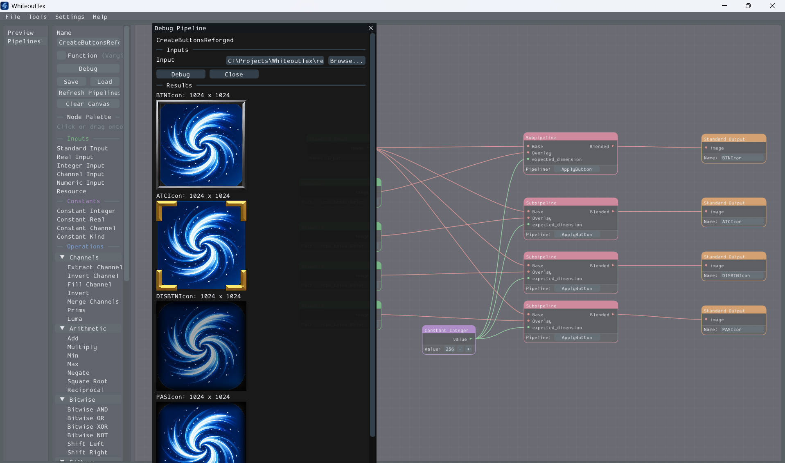

<p align="center">
  
</p>

<h1 align="center">WhiteoutTex</h1>

<p align="center">
  A fast, lightweight texture viewer and converter for game assets — with optional AI upscaling.
</p>

<p align="center">
  
</p>

<details>
<summary><h3 align="center">🖼️ More Screenshots</h3></summary>

<p align="center">
  
</p>
<br />
<p align="center">
  
</p>
<br />
<p align="center">
  
</p>
<br />
<p align="center">
  
</p>
<br />
<p align="center">
  
</p>

</details>

---

## Features

- **Open & save** textures: BLP, BMP, DDS, JPEG, PNG, PSD, TGA, TIFF, and Diablo II: Resurrected `.texture` — plus read-only support for Blizzard TEX (Diablo III/IV).
- **Image viewer** with zoom, pan, per-channel RGBA filtering, mip level selection, and auto-detection of normal maps and ORM textures.
- **Texture details** — dimensions, pixel format, mip chain info, and automatic texture kind classification (Diffuse, Normal, ORM, etc.) with manual override.
- **Mipmap generation** — one-click regeneration that respects texture kind (normal maps get renormalized, PBR textures keep correct properties).
- **Batch conversion** — convert entire directories at once, multi-threaded, with per-format filters and per-kind DDS targeting.
- **Pipelines** — a visual node-graph editor for building reusable image-processing pipelines (channel ops, math, filters, geometry, control flow, subpipelines) that run on individual textures or as a batch step.
- **CASC browser** — open Blizzard game archives directly and browse/extract textures, including full Diablo IV TEX support.
- **Save options** — format-specific settings (BLP encoding & dithering, DDS format, JPEG quality), mipmap generation on save, and preferences remembered across sessions.

### Pipelines & Node Editor

Build reusable image-processing graphs in a visual node editor and run them on your textures — no code required.

<p align="center">
  
</p>

- **Rich node library** — channel ops (extract / merge / invert / luma / prism), arithmetic and math (add, multiply, min/max, power, sine, cosine, natural log…), bitwise integer ops, filters (blur, sharpen, Sobel, derivatives), geometry (mirror, rotate, scale, displace, resize, tiling), mipmap tools, and image properties.
- **Control flow** — Conditional / Select / Rendezvous nodes and recursive **subpipelines**, including in-canvas **local pipelines** (frames).
- **Three pipeline kinds** — *Standard* (one image in/out, run straight from the Preview panel), *Varying* (many images in/out, run from the MultiPipelines dialog), and *Function* (typed numeric I/O, callable from other pipelines).
- **Categories & inline parameters** — organize pipelines by category and adjust a pipeline's extra inputs right in the Preview panel before running.
- **Debugger** — run the current graph with custom inputs and inspect every output, numeric or image, in a results dialog.
- **Batch integration** — drop a pipeline into the batch converter as a processing step, with overridable parameters.
- **AI upscaling node** — call Real-ESRGAN models from inside a pipeline (when built with the upscaler).

A library of ready-made pipelines ships in `resources/pipelines` (grayscale, invert, normal-map conversion, ORM pack/unpack, button generators, and more), with reusable building blocks under `functions/`.

<p align="center">
  
</p>

### AI Upscaling (Optional)

GPU-accelerated texture upscaling powered by **Real-ESRGAN** via Vulkan compute. Available models:

- **realesrgan-x4plus** — general-purpose 4× upscale
- **realesrgan-x4plus-anime** — anime/stylized 4× upscale
- **realesr-animevideov3** — 2×, 3×, or 4× upscale

Upscaling can be applied to individual textures or as part of a batch conversion pipeline. Requires building with `WHITEOUT_ENABLE_UPSCALER=ON` and a Vulkan SDK.

---

## Building

Requires **CMake** and a **C++23** compiler.

```bash
cmake -S . -B build
cmake --build build --config Release
```

For AI upscaling support (optional):

```bash
cmake -S . -B build -DWHITEOUT_ENABLE_UPSCALER=ON
cmake --build build --config Release
```

This requires the [Vulkan SDK](https://vulkan.lunarg.com/sdk/home). Run `scripts/download_models.ps1` to fetch the model files.

---

## License

**BSD 3-Clause** — see [LICENSE.md](LICENSE.md). An [AI-Derived Works Notice](LICENSE-AI.md) applies to AI-generated code based on this software.

## Third-Party Notices

| Library | License |
|---------|---------|
| [Dear ImGui](https://github.com/ocornut/imgui) | MIT |
| [imgui-node-editor](https://github.com/thedmd/imgui-node-editor) | MIT |
| [nlohmann/json](https://github.com/nlohmann/json) | MIT |
| [SDL3](https://github.com/libsdl-org/SDL) | zlib |
| [WhiteoutLib](https://github.com/FernandoS27/WhiteoutLib) | See library license |
| [CascLib](https://github.com/ladislav-zezula/CascLib) | MIT |
| [Real-ESRGAN ncnn](https://github.com/xinntao/Real-ESRGAN-ncnn-vulkan) | MIT *(optional)* |

Full texts in [THIRD_PARTY.md](THIRD_PARTY.md).

## Disclaimer

This project is not affiliated with or endorsed by Blizzard Entertainment.
